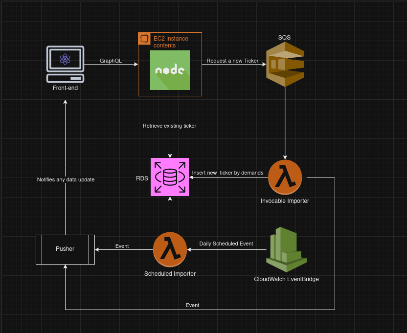

# B3 Finder

A mono repo application, which lists data from the brazilian stock market

## Table of Contents

- [About](#about)
- [Getting Started](#getting-started)
  - [Prerequisites](#prerequisites)
  - [Running Locally](#running-locally)
- [License](#license)
- [Acknowledgments](#acknowledgments)

## About

This repository houses three packages

**server** <br/>
A Node.js application with typescript, which delivers an API with GraphQL, giving to our client flexible data fetching for quotes and its histories coming from a fresh database

**contract** <br/>
This package uses `codegen` to generate type definitions from the GraphQL schema to serve both server and client

**web** <br/>
The web application that gives a beautiful and intuitive interface to empower the final user experience, receive data from server 

This application is feed by two [lambdas](https://github.com/HeenriqueCDS/b3-crawler), so it does not have any responsability on actually import new data, but it can call one of those lambdas to fetch new quotes by user demands



## Getting Started
### Prerequisites

To run the application locally

- [Node.js](https://nodejs.org/en) installed, i recommend you to always use the LTS version, but if there any conflicts, i am using `v18.7.0`
- [Docker Compose](https://docs.docker.com/compose/) to run a local database if you need *(Optional)*
- [SQS Queue](https://docs.aws.amazon.com/sqs/) to send messages [lambdas](https://github.com/HeenriqueCDS/b3-crawler), to import new data
- [Pusher Account](https://pusher.com/) to receive events at our client, then we can know when we have new fresh quotes in real-time!
Least but no less important, you need a AWS Account for obvious reasons

### Running locally

Step-by-step instructions on how to run the application locally

You'll need a database a SQS Queue and a pusher channel, after setting them up, you can just pass your credentials and urls on both `server` and `web` packages `.env` as defined in `.env.example` files

Running our backend

```bash
# First of all, we are starting by accessing the server package
cd server

# Install our dependencies
npm install

#Set your .env as suggested in .env.example
#Run the app
npm run dev

```

After running our backend with no issues, we can then start our client without any headache, with basically the same bash commands, let's open a new terminal and try

```bash
# First of all, we are starting by accessing the web package
cd web

# Install our dependencies
npm install

#Set your .env as suggested in .env.example
#Run the app
npm run dev
```

Simples as that, we should have our application running, feel free to give any suggestions for future improvement!

## License

This project is licensed under the MIT License 

## Acknowledgments

 - [Henrique](https://www.linkedin.com/in/henriquecds/), designed and developed the application
 - [Giovanni](https://www.linkedin.com/in/giovanni-sacchitiello), designed the architecture and solution

